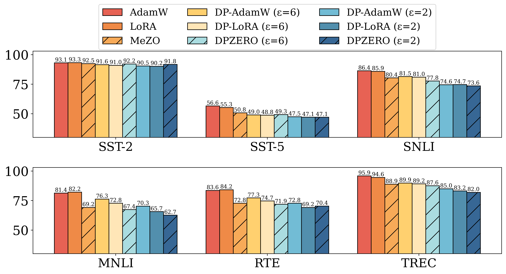
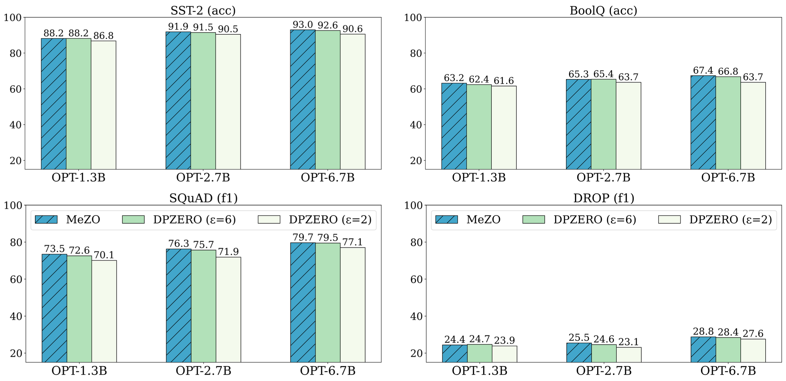

## DPZero: Private Fine-Tuning of Language Models without Backpropagation

The code is for reproducing the results of [DPZero](https://arxiv.org/abs/2310.09639) on RoBERTa and OPT.
We provide the first algorithm, DPZero, that achieves **dimension-independent** rate for DP zeroth-order optimization.
DPZero is the first private method for large model training that achieves near-zero additional costs in time and memory, as well as in the implementation, compared to non-private baselines. This makes privacy protection easier and much more memory efficient.
Our implementation is based on [MeZO](https://github.com/princeton-nlp/MeZO).

### Installation

This code is tested on `python 3.9.18`, with
`torch==2.4.0+cu121`, `transformers==4.28.1`, and `opacus==1.4.0`.

More on enviroments can be found in `environments.yml`. You can also create one using commands below.
```bash
conda env create -n dpzero -f environments.yml
conda activate dpzero
```

### Results
* Test accuracy (%) on RoBERTa-large (355M).


* Test performance (%) on OPT.


### Reproducing our results

The code for RoBERTa and OPT can be found in `./roberta` and `./opt`. 
Please see the detailed instruction therein.

### Citation

```bibtex
@inproceedings{zhang2024dpzero,
  title={{DPZero}: Private Fine-Tuning of Language Models without Backpropagation},
  author={Liang Zhang and Bingcong Li and Kiran Koshy Thekumparampil and Sewoong Oh and Niao He},
  booktitle={International Conference on Machine Learning},
  year={2024},
  organization={PMLR}
}
```